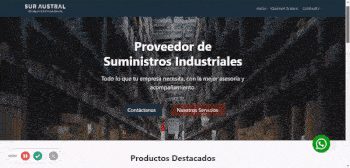

<!--
**cevenast/cevenast** is a ✨ _special_ ✨ repository because its `README.md` (this file) appears on your GitHub profile.

Here are some ideas to get you started:

- 🔭 I’m currently working on ...
- 🌱 I’m currently learning ...
- 👯 I’m looking to collaborate on ...
- 🤔 I’m looking for help with ...
- 💬 Ask me about ...
- 📫 How to reach me: ...
- 😄 Pronouns: ...
- ⚡ Fun fact: ...
-->

# Hi there!

<!--   -->

👋 I'm a full-stack software engineer who loves working with the MERN stack. 

⚙ With a background in mechanical engineering, I like to approach problems in a modular way, breaking them down into smaller, more manageable pieces. 

💬 I'm always looking for new and exciting projects to work on, so feel free to connect with me and check out my repositories. Let's collaborate and build something amazing together!

 

# Languages and tools

      

  
 
 
 

  
# Projects

<table bordercolor="#66b2b2">
  
  <tr>
    <td width="50%" valign="top">
      <h3 align="center">Granny's Food</h3>
       
      
       
      

          
        
      

      
<strong>React, Node.js, MongoDB, Express.js & Tailwind</strong> - Granny's Food is a space to browse and share your family recipes with your friends in a simple way.
      
                                                                             
    </td>
    <td width="50%" valign="top">
      <h3 align="center">Sur Austral</h3>
         
      
       
      

        
        
      

      
<strong>Django, SQLite, Bootstrap, HTML5 & CSS</strong> - Responsive corporate site for an industrial supplies distributor.

    </td>
  </tr>
  <tr>
    <!-- <td width="50%" valign="top">
      <h3 align="center"></h3>
       
        
       
        

  
  
      

        
<strong>HTML5, CSS3, & Javascript</strong> - Portfolio Site including links to my projects and ways to get in contact with me.

    </td> -->
    <td width="50%" valign="top">
      <h3 align="center">Easy NASA Imagery Access</h3>
         
        
         
        

          
  
  
      

        
<strong>HTML5, CSS3, & Javascript</strong> - Web App that allows users to easily display space data from NASA sourced APIs.

    </td>
  </tr>
</table>
